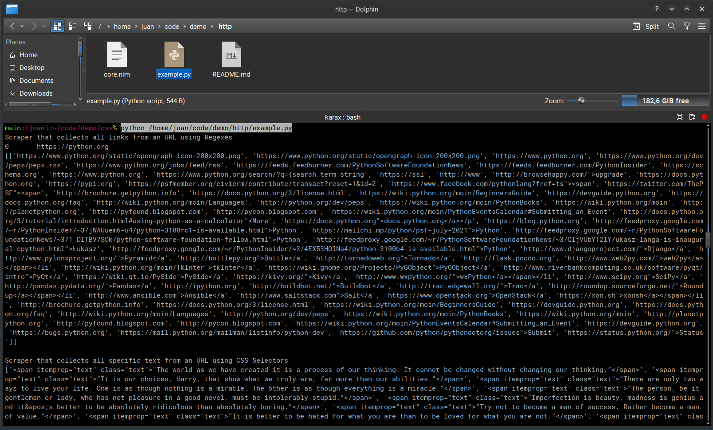

# Example Web Scrapers

- Web scraper that collects all links from an URL using a list of Regexes.
- Web scraper that collects all specific text from an URL using CSS Selectors.

# Use

`python3 example.py`

# Screenshot

