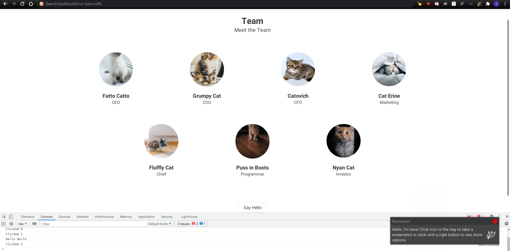

# Example web frontend

- Simple web frontend demo (No Typescript required, No Javascript required, can use Python syntax if wanted).
- You can click on the images and prints a message in console of web browser.
- Button that and prints a message in console of web browser.
- No need to write any HTML nor any DOM tags.
- Code is Reactive and uses DOM-Diffing, like React or Vue.

# Use

`python3 -m http.server` and open http://127.0.0.1:8000/app.html

# Screenshot

