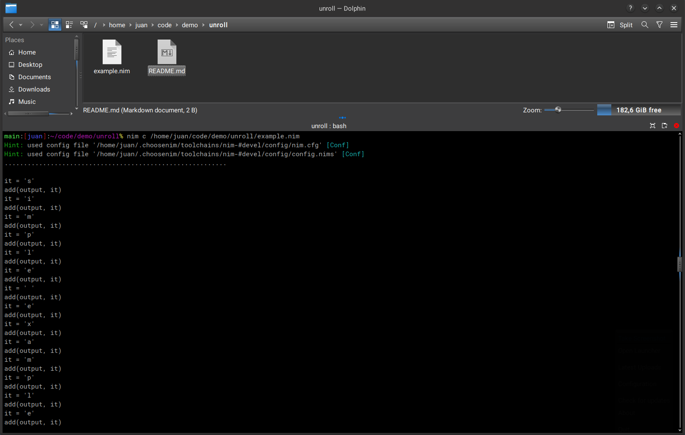

# Loop Unrolling

- Compile-time unrolled for loops with zero-overhead at run-time.
- The idea is that you "unroll" a loop at compile-time, making it literally dissapear into a linear flat code.

# Use

You have to read the terminal output, the expanded code is printed there.

`nim c example.nim`

# Observations

AFAIK This can not be done with Python, Cython, JavaScript, Go, Rust, Ruby, etc.
Only Nim and C++ can do it, but C++ uses a complex and verbose pre-processor templating-language.

# Screenshot

